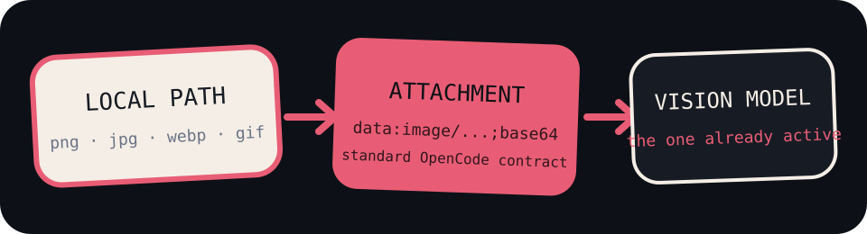
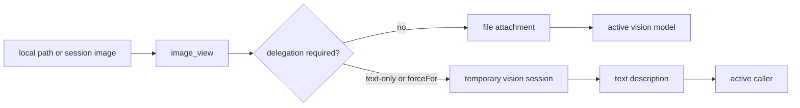
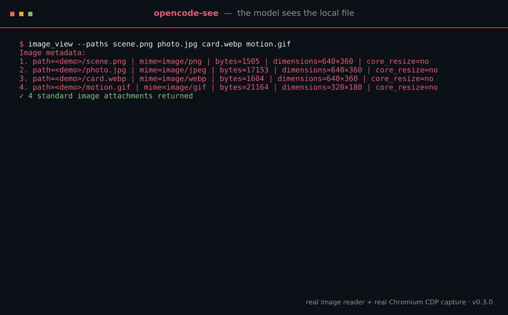

<h1 align="center">opencode-see</h1>

<p align="center"><strong>Point at a picture. Let the model look.</strong></p>

<p align="center">
  <a href="./README.md">🇬🇧 <strong>English</strong></a> · <a href="./README.ru.md">🇷🇺 Русский</a>
</p>

<p align="center">No upload service. No fork patch. No plugin-owned API key.<br>
Native attachments by default; a configurable vision delegate for text-only or explicitly selected models.</p>

<p align="center">
  
</p>

<p align="center">
  
  
  
</p>

<p align="center">
  <a href="./docs/overview.md">Overview</a> ·
  <a href="./docs/architecture.md">Architecture</a> ·
  <a href="./docs/usage.md">Usage</a> ·
  <a href="./docs/capture-backends.md">Capture backends</a> ·
  <a href="./docs/operations.md">Operations</a>
</p>

## 👁️ Why this exists

Models can read pages of text, but a screenshot, painting, diagram, or broken UI
often says more in one glance. Vision-capable models already know how to look at
images. OpenCode already knows how to transport image attachments. What was
missing was the small, boring bridge from “this file on my machine” to that
existing path.

`opencode-see` adds the bridge. It can read a local PNG, JPEG, WebP, or GIF, or
reuse images already attached in the current OpenCode session. Local paths use
the normal file permissions; session images come through the OpenCode SDK. Both
become standard attachments for vision-capable models. For text-only models, or
native models explicitly routed through a delegate, the plugin can ask a
configured vision model a specific question about the same image and return its
grounded answer as text. It can also ask a local Chromium installation to
capture a web page first.

## 🪄 The whole trick

The plugin has no provider client, API key, or OAuth flow. OpenCode owns both
provider authentication and model transport. The plugin checks the active
model's declared capabilities and the exact configured route: native vision gets
the original attachment by default, while a text-only or explicitly selected
model can receive text from a short-lived OpenCode session on the configured
vision delegate.



That keeps the plugin provider-agnostic. It works directly with any model whose
OpenCode capability declares image input, and text-only models can use any
configured vision delegate available to the same OpenCode server. The plugin
never reads or stores provider credentials.

If a compatible host performs remote mid-turn compaction before the model sees
a tool attachment, the plugin restores the latest image batch from session
history for the immediate continuation. The replay is invisible in the UI,
keeps no cache, and remains inactive for ordinary OpenCode, local compaction,
and provider paths that already deliver the images normally.

## 🎬 It really looks

<p align="center">
  
</p>

The GIF is generated by [`scripts/generate-demos.mjs`](./scripts/generate-demos.mjs)
from the real image reader and Chromium CDP capture code against disposable
local files and a localhost page.

## 🚀 Put it on your machine

The official distribution is currently GitHub-only. Node.js 22 or newer is
required because the CDP client uses the built-in WebSocket implementation.

```bash
git clone https://github.com/Krablante/opencode-see.git \
  ~/.local/share/opencode/plugins/opencode-see
cd ~/.local/share/opencode/plugins/opencode-see
npm install
```

Add the plugin source URL to `~/.config/opencode/opencode.jsonc`:

```jsonc
{
  "$schema": "https://opencode.ai/config.json",
  "plugin": [
    "file:///home/you/.local/share/opencode/plugins/opencode-see/src/index.ts"
  ]
}
```

Use an absolute `file://` URL. Restart OpenCode after changing its configuration.
OpenCodez uses its own config root but the same plugin contract.

The package contains public npm metadata because OpenCode plugins are Node
packages, but this project does **not** publish to npm. The `opencode-see` name
on npm is currently owned by an unrelated project. Do not install that package
when you want this repository; use the GitHub clone above.

## ⌨️ The tools you need

| Tool | Arguments | Result |
| --- | --- | --- |
| `image_view` | optional `paths`, `source` (`latest` or `session`), `question` | Local files, the latest current-session image batch by default, or up to five newest unique session images; returns native attachments or a question-focused delegated description |
| `screenshot` | `url`, optional `output_path`, `width`, `height`, `question` | Saved PNG plus a native attachment or question-focused delegated description and capture-backend metadata |

Ask naturally:

```text
Use image_view to inspect ./design/home.webp. Describe the layout problem.
```

```text
Look at the image I just attached and read the exact error message.
```

```text
Take a screenshot of http://localhost:3000 at 1440×900 and compare it with ~/Pictures/reference.png.
```

## 🔭 Vision delegation

Delegation is enabled by default. When the active model declares
`capabilities.input.image=false` or its exact reference appears in `forceFor`,
the plugin creates a temporary OpenCode session, sends the images to the
configured vision model, and adds this block to the tool result. When `question`
is supplied, it is appended to the configured baseline prompt so the delegate
answers the caller's exact visual question:

```text
Vision via gpt-5.6-luna:
<description returned by the vision model>
```

Configure it in `opencode-see.json`:

```json
{
  "visionDelegate": {
    "enabled": true,
    "model": "opencode-go/gpt-5.6-luna",
    "forceFor": [],
    "prompt": "Опиши содержимое каждой приложенной картинки подробно и по делу.",
    "timeoutMs": 90000,
    "deleteAfter": true
  }
}
```

`forceFor` routes the listed active models through the delegate even when they
declare native image input. Use exact `provider/model` references. Other vision
models keep receiving native attachments, while text-only models continue to
delegate automatically. The setting applies to `image_view` and `screenshot`
results; it does not rewrite images attached directly to a user message.

For example, route Sol image-tool results through the default Luna delegate:

```json
{
  "visionDelegate": {
    "forceFor": ["openai/gpt-5.6-sol"]
  }
}
```

To use an existing ChatGPT OAuth session instead, change that one model string:

```json
{
  "visionDelegate": {
    "model": "openai/gpt-5.6-luna"
  }
}
```

Those are examples, not a provider allowlist. `model` accepts any OpenCode
`provider/model` reference, including providers added by user configuration or
another plugin:

```json
{
  "visionDelegate": {
    "model": "your-provider/your-vision-model"
  }
}
```

Use the exact ID shown by `opencode models` (or `opencodez models`). The selected
provider must already be authenticated in OpenCode and the model must accept
image input. The plugin does not validate accounts, restrict providers, or
silently substitute another model; an invalid selection is returned as an
explicit delegation failure.

The OpenCode server performs the delegated request with its existing provider
authentication. Set `enabled` to `false` to return an explicit unsupported-model
message instead. Each delegated call may consume credits from the configured
provider. `OPENCODE_SEE_DELEGATE_MODEL` provides the same one-string environment
override; see [Usage](./docs/usage.md) for the remaining options and legacy
split-field compatibility.

Local images outside the active worktree require OpenCode `external_directory`
permission, and every local path requires `read` permission. Images recovered
from the current session need no new filesystem permission: the bytes are read
only from that session's existing data-URL file parts. MIME types always come
from byte signatures rather than filename extensions or attachment labels.

Screenshots default to `<active project>/.opencode/screenshots`. CDP is tried
first; ordinary Chromium/Chrome installs may fall back to the headless CLI.
Snap Chromium must use CDP because its private `/tmp` makes CLI output
unreliable. If no browser exists, the tool returns an installation hint.

See [Usage](./docs/usage.md) for configuration and every environment override.

## 🚫 What it refuses to become

- not OCR — the active or delegated vision model decides how to interpret pixels
- not image hosting — data stays local until OpenCode sends the active request
- not a provider client — no direct provider auth or provider API calls
- not a fork patch — upstream OpenCode and OpenCodez load the same plugin
- not image RAG — no embeddings, index, cache, or background process
- not a PDF reader — only PNG, JPEG, WebP, and GIF are accepted

## 🔥 Yes, it actually runs

The plugin is used daily in the maintainer's multi-machine Politia production
environment. The same repository remains generic: deployment details and
machine topology stay outside the public plugin.

## 🛠️ Contributing

Say what changed and why. That explanation is part of the change, not PR
decoration. Open an issue before starting a large feature.

See [CONTRIBUTING.md](./CONTRIBUTING.md).

## 📜 License

[MIT](./LICENSE)
