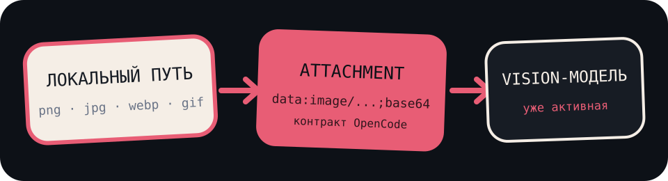
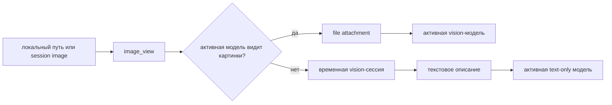
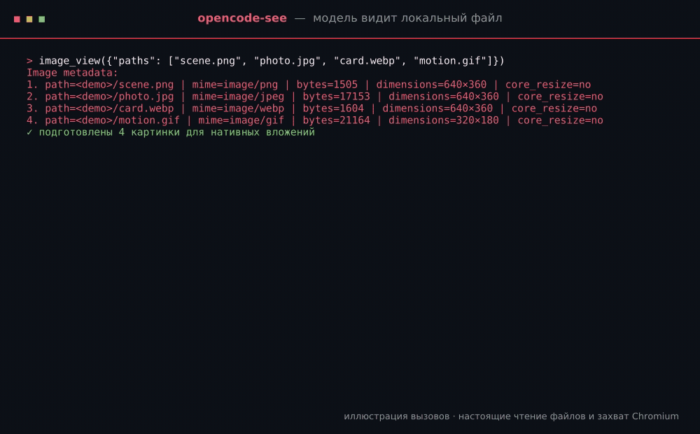

<h1 align="center">opencode-see</h1>

<p align="center"><strong>Покажи на картинку. Пусть модель посмотрит.</strong></p>

<p align="center">
  <a href="./README.md">🇬🇧 English</a> · <a href="./README.ru.md">🇷🇺 <strong>Русский</strong></a>
</p>

<p align="center">Никакого сервиса загрузки. Никакого патча форка. Никакого API key внутри плагина.<br>
Нативные attachments для vision-моделей и настраиваемый делегат для text-only моделей.</p>

<p align="center">
  
</p>

<p align="center">
  
  
  
</p>

<p align="center">
  <a href="./docs/overview.md">Обзор</a> ·
  <a href="./docs/architecture.md">Архитектура</a> ·
  <a href="./docs/usage.md">Использование</a> ·
  <a href="./docs/capture-backends.md">Захват страниц</a> ·
  <a href="./docs/operations.md">Эксплуатация</a>
</p>

## 👁️ Зачем это нужно

Модели читают страницы текста, но скриншот, картина, диаграмма или сломанный
интерфейс часто объясняют проблему одним взглядом. Vision-модели уже умеют
смотреть на изображения. OpenCode уже умеет доставлять image attachments.
Не хватало только маленького скучного моста от «вот этот файл на моём диске»
до уже существующего транспорта.

`opencode-see` добавляет этот мост. Плагин читает локальный PNG, JPEG, WebP или
GIF либо повторно использует картинки, уже приложенные в текущей OpenCode-
сессии. Локальный путь проходит через обычные файловые разрешения, а session-
картинка — через OpenCode SDK. Vision-модель получает стандартный attachment.
Для text-only модели плагин может задать настроенной vision-модели конкретный
вопрос об этой картинке и вернуть обоснованный пикселями ответ. А ещё он может
сначала попросить локальный Chromium снять страницу.

## 🪄 Весь фокус

В плагине нет клиента провайдера, API key и OAuth-флоу. Аутентификацией и
транспортом моделей владеет OpenCode. Плагин проверяет объявленные возможности
активной модели: native vision получает исходный attachment, а text-only модель
может получить текст из короткоживущей OpenCode-сессии на настроенном делегате.



Поэтому плагин остаётся провайдер-агностичным. Он напрямую работает с любой
моделью, у которой OpenCode объявляет image input, а text-only модели могут
использовать любой настроенный vision-делегат, доступный тому же серверу
OpenCode. Плагин не читает и не хранит провайдерские credentials.

Если совместимый хост выполнит серверную mid-turn compaction до того, как модель
увидит tool attachment, плагин восстановит последнюю группу изображений из
истории сессии для ближайшего продолжения. Replay не виден в UI, не создаёт кэш
и не включается в обычном OpenCode, при локальной compaction и на провайдерных
путях, которые и так штатно доставляют картинки.

## 🎬 Оно правда смотрит

<p align="center">
  
</p>

GIF собирается [`scripts/generate-demos.mjs`](./scripts/generate-demos.mjs) из
настоящих функций чтения изображений и Chromium CDP-захвата. Входные картинки,
localhost-страница и рабочий каталог одноразовые; нарисованного вручную вывода
инструмента нет.

## 🚀 Поставить к себе

Официальная раздача сейчас только через GitHub. Нужен Node.js 22 или новее:
CDP-клиент использует встроенный WebSocket.

```bash
git clone https://github.com/Krablante/opencode-see.git \
  ~/.local/share/opencode/plugins/opencode-see
cd ~/.local/share/opencode/plugins/opencode-see
npm install
```

Добавь URL исходника в `~/.config/opencode/opencode.jsonc`:

```jsonc
{
  "$schema": "https://opencode.ai/config.json",
  "plugin": [
    "file:///home/you/.local/share/opencode/plugins/opencode-see/src/index.ts"
  ]
}
```

Нужен абсолютный `file://` URL. После правки конфига перезапусти OpenCode.
OpenCodez использует отдельный config root, но тот же контракт плагинов.

Публичные npm-метаданные есть потому, что плагины OpenCode устроены как
Node-пакеты, но этот проект **не публикуется в npm**. Имя `opencode-see` в npm
уже занято чужим, не связанным с этим репозиторием проектом. Для этого плагина
не устанавливай одноимённый npm-пакет — используй GitHub-клон выше.

## ⌨️ Два инструмента

| Инструмент | Аргументы | Результат |
| --- | --- | --- |
| `image_view` | опционально `paths`, `source` (`latest` или `session`), `question` | Локальные файлы, последняя группа session-картинок по умолчанию либо до пяти новейших уникальных картинок; нативные attachments или делегированный ответ на конкретный вопрос |
| `screenshot` | `url`, опционально `output_path`, `width`, `height`, `question` | Сохранённый PNG, нативный attachment или делегированный ответ на конкретный вопрос и метаданные capture-бэкенда |

Можно просить естественно:

```text
Вызови image_view для ./design/home.webp и объясни, что сломано в раскладке.
```

```text
Посмотри на только что приложенную картинку и прочитай точный текст ошибки.
```

```text
Сними http://localhost:3000 в 1440×900 и сравни с ~/Pictures/reference.png.
```

## 🔭 Vision delegation для text-only моделей

Делегирование включено по умолчанию. Если активная модель объявляет
`capabilities.input.image=false`, плагин создаёт временную OpenCode-сессию,
отправляет картинки настроенной vision-модели и добавляет в результат инструмента.
Если передан `question`, он дополняет базовый prompt из конфига, чтобы делегат
ответил именно на визуальный вопрос вызывающей модели:

```text
Vision via gpt-5.6-luna:
<описание от vision-модели>
```

Настройка в `opencode-see.json`:

```json
{
  "visionDelegate": {
    "enabled": true,
    "model": "opencode-go/gpt-5.6-luna",
    "prompt": "Опиши содержимое каждой приложенной картинки подробно и по делу.",
    "timeoutMs": 90000,
    "deleteAfter": true
  }
}
```

Чтобы использовать существующую ChatGPT OAuth-сессию, достаточно заменить одну
строку модели:

```json
{
  "visionDelegate": {
    "model": "openai/gpt-5.6-luna"
  }
}
```

Это примеры, а не закрытый список провайдеров. `model` принимает любую ссылку
OpenCode в формате `provider/model`, в том числе на провайдера из
пользовательского конфига или другого плагина:

```json
{
  "visionDelegate": {
    "model": "your-provider/your-vision-model"
  }
}
```

Нужно указать точный ID из `opencode models` (или `opencodez models`). Выбранный
провайдер должен быть уже авторизован в OpenCode, а модель — поддерживать image
input. Плагин не проверяет аккаунты, не ограничивает провайдеров и не подменяет
нерабочую модель другой: ошибка конфигурации вернётся как явный delegation
failure.

Делегированный запрос выполняет сервер OpenCode со своей существующей
аутентификацией провайдера. При `enabled: false` плагин вместо описания честно
сообщит, что активная модель не поддерживает картинки. Каждый делегированный
вызов может расходовать кредиты настроенного провайдера. Для такого же
переключения через окружение есть `OPENCODE_SEE_DELEGATE_MODEL`; полная таблица и
совместимость со старыми раздельными полями описаны в [Usage](./docs/usage.md).

Для локальной картинки вне активного worktree OpenCode запросит
`external_directory`, а для каждого локального пути — `read`. Картинка из
текущей сессии не требует нового файлового разрешения: байты читаются только из
уже существующих data-URL file parts этой сессии. MIME всегда определяется по
сигнатуре байтов, а не по расширению или label attachment.

Скриншоты по умолчанию лежат в `<активный проект>/.opencode/screenshots`.
Сначала используется CDP; обычные установки Chromium/Chrome могут откатиться
на headless CLI. Для snap Chromium CDP обязателен: приватный `/tmp` делает CLI-
вывод ненадёжным. Если браузера нет, инструмент вернёт понятную команду
установки.

Полный конфиг и переменные окружения — в [Usage](./docs/usage.md).

## 🚫 Во что плагин не превратится

- не OCR — пиксели интерпретирует активная или делегированная vision-модель
- не хостинг картинок — файл остаётся локальным до запроса OpenCode
- не клиент провайдера — никакого прямого auth или вызова provider API
- не патч форка — один плагин загружается OpenCode и OpenCodez
- не image RAG — никаких эмбеддингов, индекса, кэша и фонового процесса
- не PDF-reader — принимаются только PNG, JPEG, WebP и GIF

## 🔥 Да, оно работает

Плагин ежедневно используется в production-мультихост-среде Politia автора.
Сам репозиторий остаётся универсальным: детали деплоя и топология машин в
публичный плагин не попадают.

## 🛠️ Контрибьюция

Объясни, что и зачем меняешь. Это часть изменения, а не украшение PR. Перед
большой фичей сначала открой issue.

Подробности — в [CONTRIBUTING.md](./CONTRIBUTING.md).

## 📜 Лицензия

[MIT](./LICENSE)
