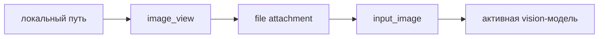

<h1 align="center">opencode-see</h1>

<p align="center"><strong>Покажи на картинку. Пусть модель посмотрит.</strong></p>

<p align="center">
  <a href="./README.md">🇬🇧 English</a> · <a href="./README.ru.md">🇷🇺 <strong>Русский</strong></a>
</p>

<p align="center">Никакого сервиса загрузки. Никакой второй модели. Никакого патча форка.<br>
Один локальный путь, один стандартный attachment и vision-модель, которой ты уже пользуешься.</p>

<p align="center">
  
</p>

<p align="center">
  
  
  
</p>

<p align="center">
  <a href="./docs/overview.md">Обзор</a> ·
  <a href="./docs/architecture.md">Архитектура</a> ·
  <a href="./docs/usage.md">Использование</a> ·
  <a href="./docs/capture-backends.md">Захват страниц</a> ·
  <a href="./docs/operations.md">Эксплуатация</a>
</p>

## 👁️ Зачем это нужно

Модели читают страницы текста, но скриншот, картина, диаграмма или сломанный
интерфейс часто объясняют проблему одним взглядом. Vision-модели уже умеют
смотреть на изображения. OpenCode уже умеет доставлять image attachments.
Не хватало только маленького скучного моста от «вот этот файл на моём диске»
до уже существующего транспорта.

`opencode-see` добавляет этот мост. Плагин читает локальный PNG, JPEG, WebP или
GIF, запрашивает обычные файловые разрешения OpenCode и возвращает стандартный
attachment. А ещё он может сначала попросить локальный Chromium снять страницу.

## 🪄 Весь фокус

В плагине нет клиента провайдера, API key, OAuth-флоу и маршрутизации моделей.
Активный транспорт OpenCode сам превращает attachment в тот image input,
который ожидает текущая модель.



Поэтому плагин модельно-агностичен. Он работает с любой комбинацией
провайдера и модели, у которой OpenCode объявляет поддержку image input. Та же
картинка может уйти через активную ChatGPT OAuth-сессию — самому плагину API key
не нужен.

Если совместимый хост выполнит серверную mid-turn compaction до того, как модель
увидит tool attachment, плагин восстановит последнюю группу изображений из
истории сессии для ближайшего продолжения. Replay не виден в UI, не создаёт кэш
и не включается в обычном OpenCode, при локальной compaction и на провайдерных
путях, которые и так штатно доставляют картинки.

## 🎬 Оно правда смотрит

<p align="center">
  
</p>

GIF собирается [`scripts/generate-demos.mjs`](./scripts/generate-demos.mjs) из
настоящих функций чтения изображений и Chromium CDP-захвата. Входные картинки,
localhost-страница и рабочий каталог одноразовые; нарисованного вручную вывода
инструмента нет.

## 🚀 Поставить к себе

Официальная раздача сейчас только через GitHub. Нужен Node.js 22 или новее:
CDP-клиент использует встроенный WebSocket.

```bash
git clone https://github.com/Krablante/opencode-see.git \
  ~/.local/share/opencode/plugins/opencode-see
cd ~/.local/share/opencode/plugins/opencode-see
npm install
```

Добавь URL исходника в `~/.config/opencode/opencode.jsonc`:

```jsonc
{
  "$schema": "https://opencode.ai/config.json",
  "plugin": [
    "file:///home/you/.local/share/opencode/plugins/opencode-see/src/index.ts"
  ]
}
```

Нужен абсолютный `file://` URL. После правки конфига перезапусти OpenCode.
OpenCodez использует отдельный config root, но тот же контракт плагинов.

Публичные npm-метаданные есть потому, что плагины OpenCode устроены как
Node-пакеты, но этот проект **не публикуется в npm**. Имя `opencode-see` в npm
уже занято чужим, не связанным с этим репозиторием проектом. Для этого плагина
не устанавливай одноимённый npm-пакет — используй GitHub-клон выше.

## ⌨️ Два инструмента

| Инструмент | Аргументы | Результат |
| --- | --- | --- |
| `image_view` | `paths` — от 1 до 5 абсолютных, project-relative или `~/` путей | Attachments плюс путь, MIME, байты, размеры и признак будущего ресайза ядром |
| `screenshot` | `url`, опционально `output_path`, `width`, `height` | Сохранённый PNG, attachment и метаданные capture-бэкенда |

Можно просить естественно:

```text
Вызови image_view для ./design/home.webp и объясни, что сломано в раскладке.
```

```text
Сними http://localhost:3000 в 1440×900 и сравни с ~/Pictures/reference.png.
```

Для картинки вне активного worktree OpenCode запросит `external_directory`.
Для каждой картинки будет запрошен `read`. MIME определяется по сигнатуре
файла, а не по расширению.

Скриншоты по умолчанию лежат в `<активный проект>/.opencode/screenshots`.
Сначала используется CDP; обычные установки Chromium/Chrome могут откатиться
на headless CLI. Для snap Chromium CDP обязателен: приватный `/tmp` делает CLI-
вывод ненадёжным. Если браузера нет, инструмент вернёт понятную команду
установки.

Полный конфиг и переменные окружения — в [Usage](./docs/usage.md).

## 🚫 Во что плагин не превратится

- не OCR — пиксели интерпретирует активная модель
- не хостинг картинок — файл остаётся локальным до запроса OpenCode
- не клиент провайдера — никакого auth и никаких API-вызовов
- не патч форка — один плагин загружается OpenCode и OpenCodez
- не image RAG — никаких эмбеддингов, индекса, кэша и фонового процесса
- не PDF-reader — принимаются только PNG, JPEG, WebP и GIF

## 🔥 Да, оно работает

Плагин ежедневно используется в production-мультихост-среде Politia автора.
Сам репозиторий остаётся универсальным: детали деплоя и топология машин в
публичный плагин не попадают.

## 🛠️ Контрибьюция

Объясни, что и зачем меняешь. Это часть изменения, а не украшение PR. Перед
большой фичей сначала открой issue.

Подробности — в [CONTRIBUTING.md](./CONTRIBUTING.md).

## 📜 Лицензия

[MIT](./LICENSE)
