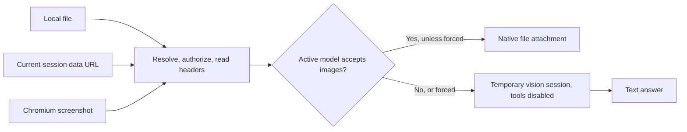

# Architecture

[English](./architecture.md) · [Русский](./architecture.ru.md) · [Home](../README.md)

The plugin owns image acquisition and the choice between a native attachment
and delegated text. OpenCode owns authentication, provider transport, model
execution, and session storage. There is no separate provider client, browser
service, persistent cache, or build output.

## Responsibilities

| Source | Owns |
| --- | --- |
| `src/index.ts` | Tool schemas, orchestration, and OpenCode hooks |
| `src/view.ts` | Local path permissions, format headers, image preparation |
| `src/session-images.ts` | Current-session history selection and data-URL extraction |
| `src/capture.ts` | Browser discovery, CDP/CLI lifecycle, and screenshot output |
| `src/vision.ts` | Native versus delegate route and result formatting |
| `src/capability.ts` | Active model capability, cached by session |
| `src/delegate.ts` | Temporary model request, cancellation, and session cleanup |
| `src/compaction-replay.ts` | Restore fresh image tool attachments at one remote compaction boundary |
| `src/config.ts`, `src/constants.ts` | Configuration precedence, validation, defaults, and limits |

The entry point exports only the plugin initializer, with named and default
aliases of the same function. Some OpenCode loaders call each distinct runtime
export as an initializer, so ordinary helpers belong in their owning modules.

## Image acquisition and cost

Local paths pass through `realpath` before permission checks. The resolved target
cannot hide outside the worktree behind an ordinary symlink. After authorization,
files are read sequentially, with a 20 MiB size check before reading and another
check on the returned bytes. Header parsing avoids an image-decoding dependency.
Base64 adds roughly one third to stored byte size; up to five data URLs remain
in the result. The host controls downstream resize and provider conversion.

Session retrieval starts with the newest 64 messages for both source modes.
It doubles the requested limit only if more history is needed. `latest` stops
at the first valid batch; `session` stops at five valid unique images or the end
of history. Only selected candidates are decoded, and their existing base64 is
reused. Stored metadata never substitutes for signature checks.

The legacy SDK exposes a tail limit rather than cursor pagination. An old image
or a session with fewer than five unique images can still require reading the
whole history. Growing windows can transfer roughly twice that history before
the final request. The plugin keeps no second index or cache to maintain.

## Model routing and cleanup

`chat.params` records the active model's declared image capability. Tools use
that per-session value and fall back to session metadata and the provider catalog
if needed. An unknown capability is treated conservatively. Session deletion
removes its cache entry. An exact `forceFor` match selects delegation even for
a native model.

Delegation creates one temporary session and sends ordinary file parts through
the OpenCode SDK. `tools: { "*": false }` disables agent tools in that session.
The result must contain assistant text without an assistant error. The calling
tool's cancellation and one timeout bound creation and prompting; an aborted
request also invokes the server's session-abort endpoint. Deletion is enabled
by default. Abort and deletion each have a separate bounded cleanup request.
No provider credentials are read or copied.

## Browser lifecycle

CDP starts a headless Chromium with a fresh profile and a random loopback
debugging port. The plugin reads `DevToolsActivePort`, discovers the page target,
sets viewport metrics, navigates, waits for load and late content, then captures
a viewport PNG. HTTP and WebSocket traffic control only that browser; the page
itself can access services reachable from the host.

An ordinary installation can fall back to Chromium's screenshot CLI after a CDP
failure. Snap Chromium uses CDP only: its private `/tmp` makes CLI file handoff
unreliable. Snap profiles live in snap-visible user storage. CLI also uses a
private profile, not the operator's default browser profile.

One deadline covers both attempts. Cancellation or timeout skips fallback.
Closing CDP settles command and event waits. Each attempt stops its browser and
removes its profile before returning. Unix launches use a private process group;
shutdown allows one second for SIGTERM before SIGKILL and kills remaining group
members. Windows uses child-process termination. Cleanup may extend elapsed
time beyond the capture deadline. The final PNG is checked and saved with an
exclusive write after resolving output-directory symlinks.

## Remote compaction replay

The message transform normally performs no I/O. It acts only when the final two
projected messages are an automatic OpenAI remote `mid-turn` compaction marker
and its completed assistant summary. The marker must carry the original turn ID.

The hook reads at most 32 recent messages with a five-second request deadline
and restores up to five completed
`image_view` or `screenshot` attachments from the preceding assistant step of
that turn. The synthetic message exists only in the model projection. It adds
no persisted message, UI row, cache, or separate provider lookup. Ordinary
OpenCode, local compaction, other providers, and later continuations skip this
path.
