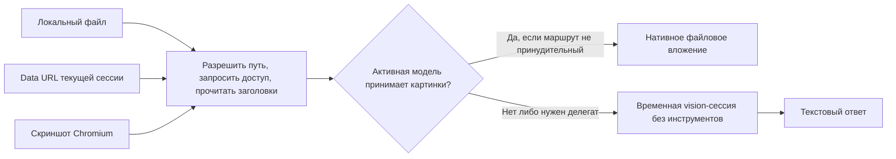

# Архитектура

[English](./architecture.md) · [Русский](./architecture.ru.md) · [Главная](../README.ru.md)

Плагин получает изображения и выбирает между нативным вложением и текстом
делегата. OpenCode отвечает за авторизацию, транспорт провайдеров, выполнение
модели и хранение сессий. Отдельного клиента провайдера, браузерного сервиса,
постоянного кэша и результатов сборки нет.

## Обязанности частей

| Исходник | За что отвечает |
| --- | --- |
| `src/index.ts` | Схемы инструментов, последовательность вызовов и хуки OpenCode |
| `src/view.ts` | Разрешения на локальные пути, заголовки форматов, подготовка картинок |
| `src/session-images.ts` | Выбор истории текущей сессии и извлечение data URL |
| `src/capture.ts` | Поиск браузера, жизненный цикл CDP/CLI и сохранение скриншота |
| `src/vision.ts` | Нативный маршрут либо делегат, формат результата |
| `src/capability.ts` | Возможности активной модели с кэшем по сессии |
| `src/delegate.ts` | Временный запрос к модели, отмена и очистка сессии |
| `src/compaction-replay.ts` | Восстановление свежих вложений на конкретной границе серверного сжатия |
| `src/config.ts`, `src/constants.ts` | Приоритет настроек, проверка значений, начальные параметры и пределы |

Точка входа экспортирует только инициализатор плагина: именованный и default
экспорты ссылаются на одну функцию. Некоторые загрузчики OpenCode вызывают
каждый отдельный экспорт как инициализатор. Обычные функции поэтому остаются
в своих модулях.

## Получение картинок и стоимость операций

Локальные пути проходят через `realpath` до запроса разрешений. Обычный симлинк
внутри рабочего дерева не скрывает внешнюю цель. После разрешения файлы читаются
последовательно. Предел в 20 MiB проверяется до чтения и повторно на полученных
байтах. Чтение заголовков обходится без библиотеки декодирования изображений.
Base64 увеличивает объём примерно на треть; в результате остаётся до пяти
data URL. Уменьшением картинок и преобразованием для провайдера управляет хост.

Поиск в сессии начинается с 64 последних сообщений в обоих режимах. Если
истории недостаточно, запрашиваемый предел удваивается. `latest` останавливается
на первой подходящей группе, `session` — на пяти уникальных картинках либо
конце истории. Декодируются только выбранные кандидаты; существующий base64
используется повторно. Метаданные вложения не заменяют проверку сигнатуры.

Старый SDK поддерживает предел для хвоста истории, но не курсорную пагинацию.
Старая картинка либо сессия с менее чем пятью уникальными изображениями всё ещё
могут потребовать всю историю. Растущие окна способны передать примерно два
объёма истории перед последним запросом. Плагин не заводит второй индекс или
кэш, который пришлось бы обслуживать.

## Выбор модели и очистка

`chat.params` сохраняет объявленную поддержку картинок активной моделью.
Инструменты используют это значение для сессии; при его отсутствии проверяют
метаданные сессии и каталог провайдеров. Неизвестная возможность не считается
поддержкой. При удалении сессии удаляется и запись кэша. Точное совпадение с
`forceFor` выбирает делегата даже для нативной модели.

Делегирование создаёт одну временную сессию и отправляет обычные файловые части
через OpenCode SDK. `tools: { "*": false }` отключает инструменты агента в этой
сессии. Для успеха нужен текст помощника без ошибки в его сообщении. Отмена
исходного инструмента и общий таймаут ограничивают создание сессии и запрос
ответа. Прерванный запрос дополнительно вызывает серверную остановку сессии.
Удаление включено по умолчанию. Запросы остановки и удаления ограничены отдельно.
Данные авторизации провайдера не читаются и не копируются.

## Жизненный цикл браузера

CDP запускает Chromium без интерфейса с новым профилем и случайным отладочным
портом на loopback. Плагин читает `DevToolsActivePort`, находит страницу,
задаёт размеры окна, переходит по URL, ждёт загрузки и позднего содержимого,
затем снимает PNG видимой области. HTTP и WebSocket управляют этим браузером;
сама страница имеет доступ к сервисам, достижимым с хоста.

После сбоя CDP обычная установка может перейти на CLI Chromium. Для Snap
работает только CDP: приватный `/tmp` делает обмен файлами через CLI ненадёжным.
Профили Snap создаются в доступном ему пользовательском хранилище. CLI тоже
работает в отдельном профиле, а не в обычном профиле пользователя.

Один таймаут покрывает обе попытки. Отмена и истечение времени исключают
резервный запуск. Закрытие CDP завершает ожидания команд и событий. Каждая
попытка останавливает браузер и удаляет профиль до возврата результата. В Unix
браузер имеет свою группу процессов. После SIGTERM даётся одна секунда до
SIGKILL; оставшиеся участники группы тоже завершаются. В Windows завершается
дочерний процесс. Очистка способна продлить вызов после таймаута захвата.
Готовый PNG проверяется и создаётся эксклюзивной записью после разрешения
симлинков каталогов назначения.

## Восстановление после серверного сжатия

Хук преобразования сообщений обычно не выполняет I/O. Он действует только
на последней паре сообщений: автоматический маркер OpenAI remote `mid-turn`
и завершённое резюме помощника. Маркер должен содержать ID исходного хода.

Хук читает не больше 32 последних сообщений с таймаутом запроса в пять секунд
и восстанавливает до пяти
завершённых вложений `image_view` либо `screenshot` из предыдущего шага
помощника того же хода. Синтетическое сообщение существует только во входе
модели. Оно не создаёт сохранённого сообщения, строки интерфейса, кэша или
отдельного запроса провайдера. Обычный OpenCode, локальное сжатие, другие
провайдеры и последующие продолжения пропускают этот путь.
